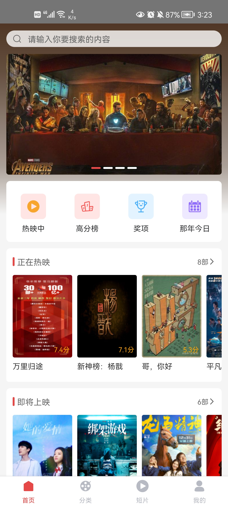

Readme | [平台差异对比](docs/difference.md) | [阿里字体图标](docs/iconfont.md) | [项目插件](docs/plugin.md)

## 环境要求

需要 NodeJS 16.0.0+ 环境


需要 Java JDK 11+ 环境


需要 Android SDK 31+ 环境


## 简介

本项目是一个仿写[慕影网H5端](https://github.com/NameLi/muying-h5)项目。

## 项目使用技术栈

* React
* React Native 0.70.1
* Redux
* Typescript

## 插件介绍

阿里字体图标
* 详细文档请查看: [docs/iconfont.md](docs/iconfont.md)

项目其余插件
* 详细文档请查看: [docs/plugin.md](docs/plugin.md)

## 加入项目

如果想加入本项目开发，需将项目fork到自己的仓库下，功能开发完成后，提PR即可。

## 运行

启动项目

```
yarn install
```

```
yarn start
```

```
yarn android
```

## 项目效果图

|首页|分类|短片|我的|
|---|---|---|---|
|||||

## 写在最后

* [The MIT License (MIT)](https://github.com/xlz122/react-native-movie/blob/master/LICENSE)
* 本项目仅用于学习使用，切勿用于商业用途，否则产生的法律后果与作者无关。
