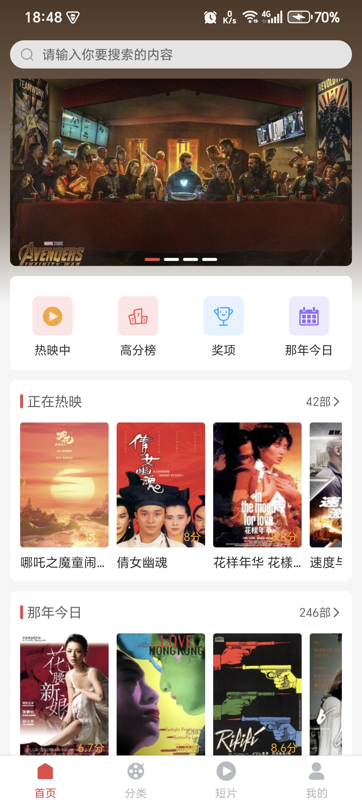
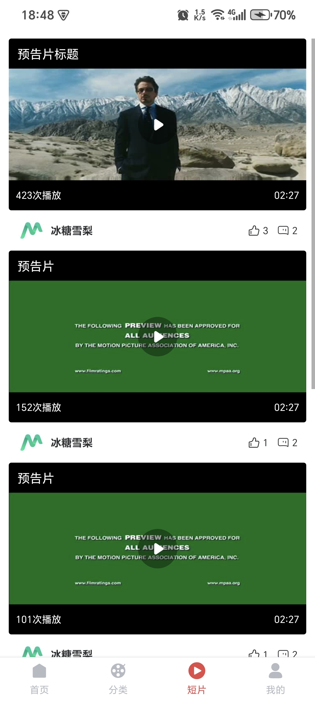

Readme | [阿里字体图标](docs/iconfont.md) | [插件介绍](docs/plugin.md) | [平台差异对比](docs/difference.md) | [打包](docs/release.md) 

## 环境要求

需要 NodeJS 18.0.0+ 环境

需要 Java JDK 17    环境

需要 Android SDK 35 环境

## 简介

本项目是一个仿写 [慕影网](https://github.com/NameLi/muying-h5) 项目，支持Android端、IOS端、Web端，Web端可查看 [web-webpack](https://github.com/xlz122/react-native-movie/tree/web-webpack) 分支

感谢 [ZhuAiQuan](https://github.com/ZhuAiQuan) 为项目适配 IOS 端！

## 项目使用技术栈

* React
* React Native 0.79.0
* Redux
* Typescript

## 加入项目

如果想加入本项目开发，需将项目fork到自己的仓库下，功能开发完成后，提PR即可。

## 运行

启动项目

```
yarn install
```

```
yarn start
```

```
yarn android
```

## 项目效果图

|首页|分类|短片|我的|
|---|---|---|---|
|||||

|搜索|详情|登录|关于|
|---|---|---|---|
|||||

## 写在最后

* [The MIT License (MIT)](https://github.com/xlz122/movie/blob/master/LICENSE)
* 本项目仅用于学习使用，切勿用于商业用途，否则产生的法律后果与作者无关。
