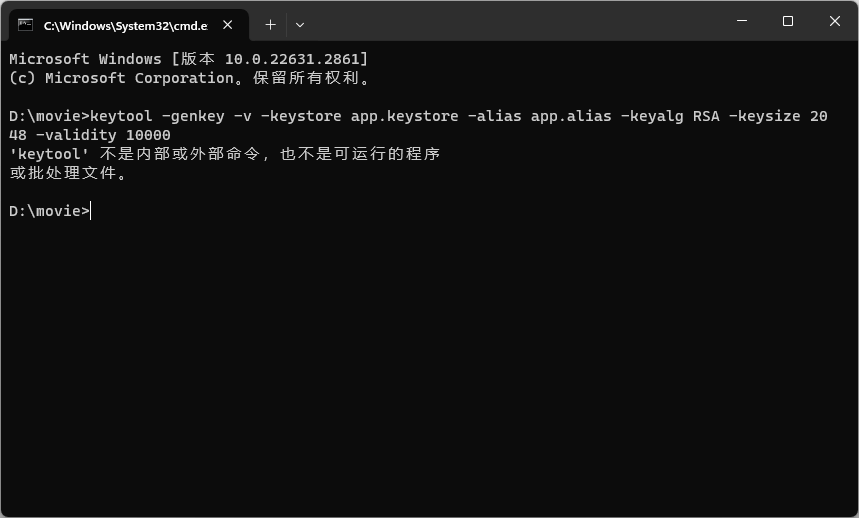
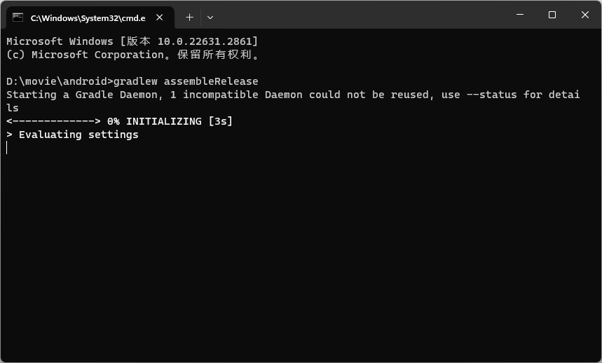
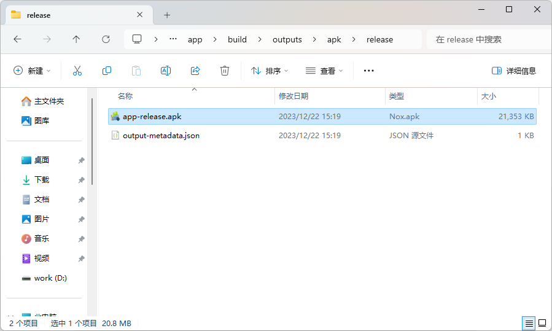

[Readme.md](../README.md) | [阿里字体图标](./iconfont.md) | [插件介绍](./plugin.md) | [平台差异对比](./difference.md) | 打包

# Android

## 1.生成签名密钥

在项目根目录，打开命令提示符，执行以下命令

```
keytool -genkey -v -keystore app.keystore -alias app.alias -keyalg RSA -keysize 2048 -validity 10000
```

* -keystore - 自定义名称，示例：app.keystore
* -alias - 自定义别名，示例：app.alias
* 密钥库口令 - 示例：123456


如果出现以下情况，请配置 Java JDK 环境变量



## 2.将根目录下的 app.keystore 文件移动至 android/app 文件夹下


## 3.打包配置

打开 android/app/build.gradle 文件

### 配置 signingConfigs

新增 release 配置项

* storeFile file - app.keystore文件的绝对路径
* storePassword - 密钥库口令
* keyAlias - 自定义别名
* keyPassword - 密钥库口令

```diff
signingConfigs {
  debug {
    storeFile file('debug.keystore')
    storePassword 'android'
    keyAlias 'androiddebugkey'
    keyPassword 'android'
  }
+ release {
+   storeFile file('app.keystore')
+   storePassword '123456'
+   keyAlias 'app.alias'
+   keyPassword '123456'
+ }
}
```

### 配置 buildTypes

修改 signingConfig 配置项

```diff
buildTypes {
  debug {
    signingConfig signingConfigs.debug
  }
  release {
    // Caution! In production, you need to generate your own keystore file.
    // see https://reactnative.dev/docs/signed-apk-android.
-   signingConfig signingConfigs.debug
+   signingConfig signingConfigs.release
    minifyEnabled enableProguardInReleaseBuilds
    proguardFiles getDefaultProguardFile("proguard-android.txt"), "proguard-rules.pro"
  }
}
```

### 配置 enableProguardInReleaseBuilds

```diff
- def enableProguardInReleaseBuilds = false
+ def enableProguardInReleaseBuilds = true
```

## 4.打包

进入 andriod 目录下，打开命令提示符，执行以下命令

```
gradlew assembleRelease
```



打包成功后，在 android/app/build/outputs/apk/release 文件夹下，可以找到 app-release.apk 文件



# IOS

未适配
