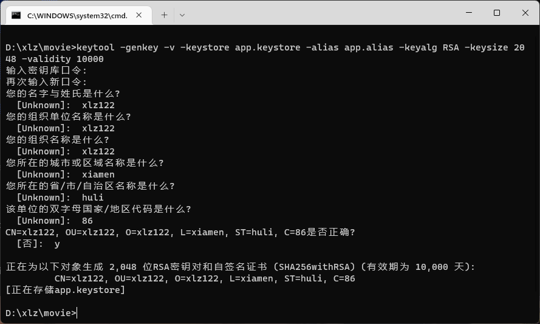
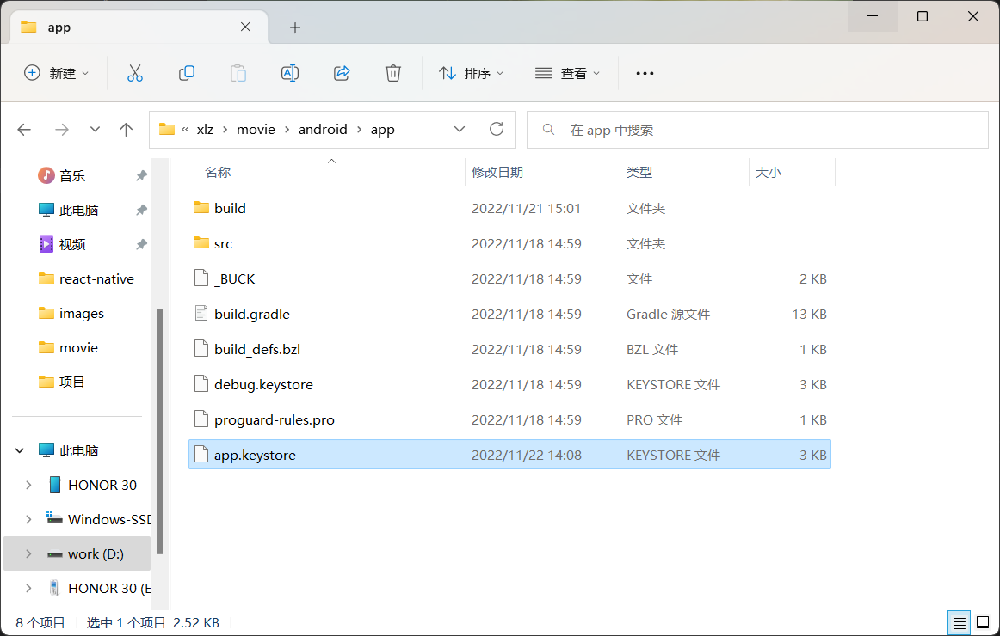
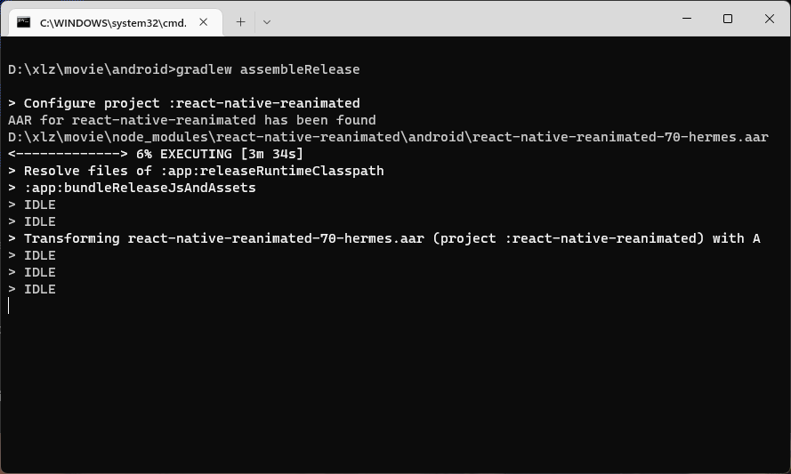
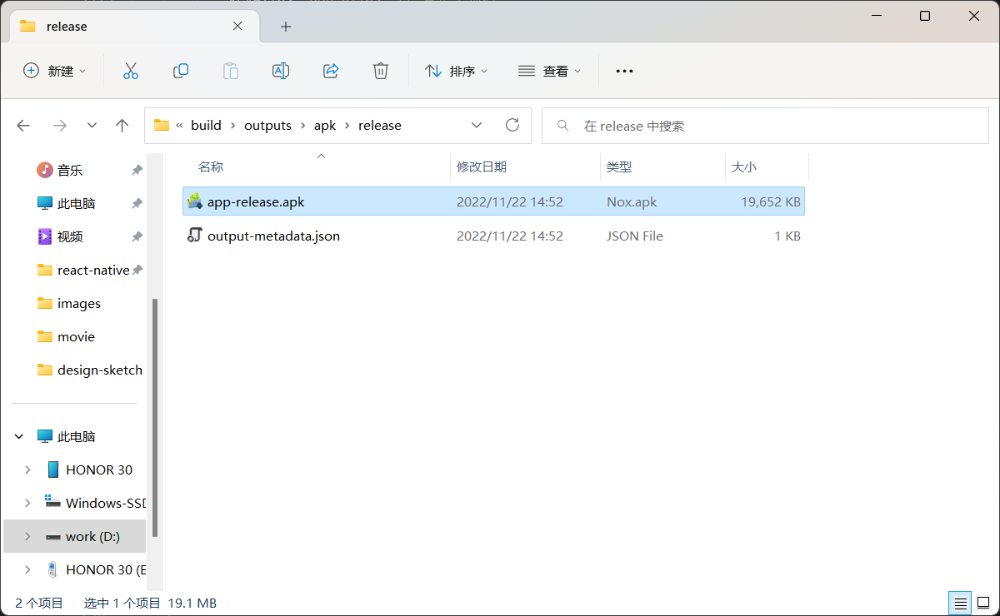

[Readme.md](../README.md) | [阿里字体图标](./iconfont.md) | [插件介绍](./plugin.md) | [平台差异对比](./difference.md) | 打包apk 

# Android打包

## 1.生成签名

项目根目录打开CMD命令符，运行以下命令

* app.keystore - 自定义文件名称(打包后的apk文件名)
* app.alias - 自定义别名(打包配置时需要用到)

```
keytool -genkey -v -keystore app.keystore -alias app.alias -keyalg RSA -keysize 2048 -validity 10000
```

* 密钥库口令(打包配置时需要用到)



## 2.将生成的 app.keystore 文件放置在 android/app 文件夹下



## 3.打开 android/app/build.gradle 文件，修改如下配置

* signingConfigs

```
signingConfigs {
  release {
    storeFile file('app.keystore') // app.keystore文件的绝对路径
    storePassword 'android'
    keyAlias 'app.alias' // 自定义别名
    keyPassword '123456' // 密钥库口令
  }
}
```

* buildTypes

```
buildTypes {
  debug {
    signingConfig signingConfigs.debug
  }
  release {
    // Caution! In production, you need to generate your own keystore file.
    // see https://reactnative.dev/docs/signed-apk-android.
    signingConfig signingConfigs.release // 将默认的 debug 改成 release
    minifyEnabled enableProguardInReleaseBuilds
    proguardFiles getDefaultProguardFile("proguard-android.txt"), "proguard-rules.pro"
  }
}
```

* enableProguardInReleaseBuilds

```
def enableProguardInReleaseBuilds = true // 将默认的 false 改成 true
```

## 4.进入 andriod 根目录运行

```
gradlew assembleRelease
```



## 5.执行完毕后，在 android/app/build/outputs/apk/release 中可以找到 app-release.apk 文件



# IOS打包

未适配
